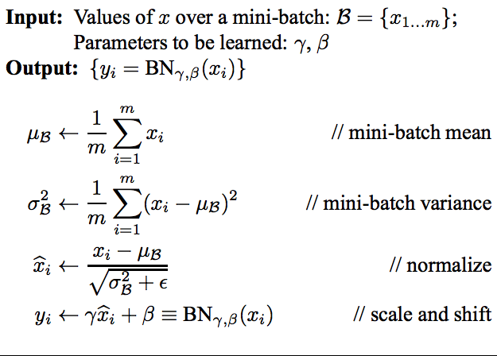
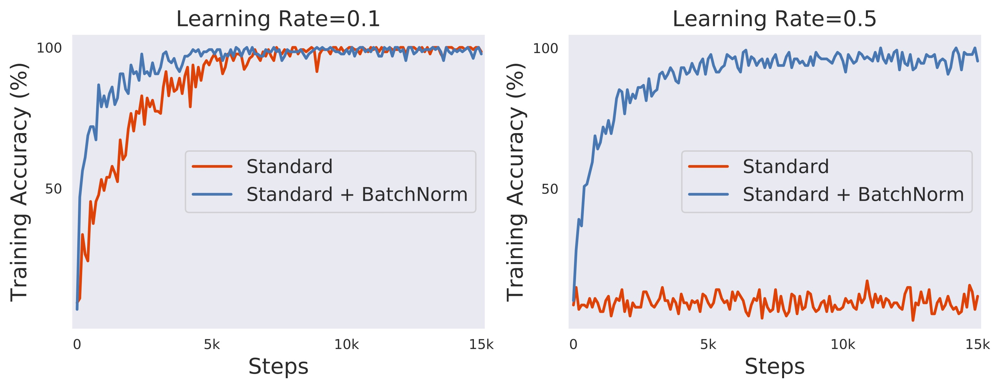
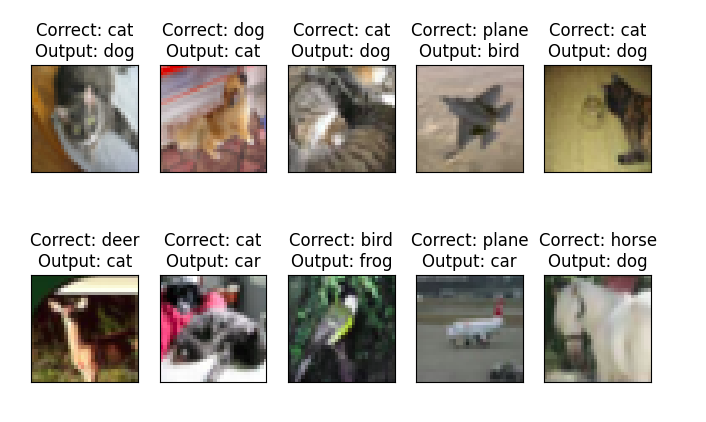

# Assignment 8: Normalization and Regularization

## Problem Staement :
  - Model should follow C1 C2 c3 P1 C4 C5 C6 c7 P2 C8 C9 C10 GAP c11
  - where cN is 1x1 Layer
  - Model should achieve 70%+ accuracy under 50,000 parameters within 20 epochs

## Code Details

This repository contains following files:

- `model.py`: This script contains  different model architectures and model summary
- `training_utils.py`: This script contains   functions to train the model on training and test dataset
- `utils.py`: This script contains functions to print out statistics,  and get the misclassified images amd different plots/graphs
- `S8_batch`: This script contains code to train model on CIFAR dataset with Batch Normalization
- `S8_layer`: This script contains code to train model on CIFAR dataset with Layer Normalization
- `S8_group`: This script contains code to train model on CIFAR dataset with Group Normalization

---

## Some Concepts:

### Data Normalization

- It involves altering the spectrum of pixel intensity values."
- Normalization merely adjusts the magnitude of the information without compromising its integrity."
- One can restore the initial data, reversing the adjustments."
- Modifying the magnitude aids in concentrating on features of comparable scales."

### Data Standardization

- This process entails adjusting all pixel values to fall within the range of 0 to 1.
- It preserves the integrity of the original data.
- It is feasible to restore the original data.

---

## Batch Normalization

- Introduced in 2015, it stands as the primary facilitator for constructing deeper networks.
- During batch normalization, mean ($\mu$) and variance ($\sigma^2$) of all input channels within a batch are computed.
- These statistical metrics are employed to normalize the values of these channels within the range of -1 to 1.
- Subsequent layers utilize these adjusted channels.
- Batch normalization ensures that after each layer, features are scaled down to a range of -1 to 1, thus mitigating the issue of gradient explosion.
- This capability enables the construction of deeper networks.

- The following diagram illustrates the increase in the number of layers facilitated by Batch Normalization."

  

- It addresses the issue of Internal Covariance Shift, which involves features being at varying scales.
- In essence, Batch Normalization improves features for subsequent layers, leading to faster and smoother training.

- Here's the mathematical equation for Batch Normalization algorithm

- The elegance of this equation lies in the inclusion of parameters $\gamma$ and $\beta$, which handle scale and shift variances.
- Should the image already be normalized or not require normalization, Backpropagation will adjust these parameters to zero, nullifying the impact of Batch  Normalization on the layer.

- This negates the necessity for meticulous hyperparameter optimization.
- Shown below is an instance of VGG trained using Batch Normalization across various learning rates.

  

It's evident that the model employing Batch Normalization converges more rapidly. Even with a higher learning rate of 0.5, it manages to converge and attain an accuracy level that would be challenging to achieve without it."

---

## Types of Different Normalization

- Following Batch Normalization, various normalization algorithms have been developed.
- Batch Normalization normalizes each input channel within a batch.
- Layer Normalization normalizes all input channels collectively.
- Group Normalization forms groups among channels and then normalizes them."
- Batch Normalization is used to solve Vision based problems
- Layer Normalization is used to solveNLP

- Below is how the mean and variance is calculated for Batch, Layer and Group Normalization. [File Link](https://github.com/Shivdutta/ERA2-Session8/Normalizations.xlsx)

- All training model parameters remain consistent; the sole distinction lies in the choice of normalization layer utilized.

|                         | Batch Normalization            | Layer Normalization             | Group Normalization                            |
| ----------------------- | ------------------------------ | ------------------------------- | ---------------------------------------------- |
| Number of Parameters    | 44,640                         | 44,640                          | 44,640                                         |
| Best Train Accuracy (%) | 73.60                          | 70.00                           | 70.                                          |
| Best Test Accuracy (%)  | 76.17                          | 71.99                           | 70.69                                          |
| Number of Means         | Input Channels                 | Images per Batch                | (Input Channels / Groups) * Batch Size         |
| Number of Variances     | Input Channels                 | Images per Batch                | (Input Channels / Groups) * Batch Size         |
| PyTorch Implementation  | `nn.BatchNorm2d(out_channels)` | `nn.GroupNorm(1, out_channels)` | `nn.GroupNorm(number_of_groups, out_channels)` |

- From the above table, it is clear that Batch Normalization outperformed Layer and Group normalization
- Below are the training graphs and misclassified images for each model

| Batch Normalization                     | Layer Normalization                                          | Group Normalization                                          |
| --------------------------------------- | ------------------------------------------------------------ | ------------------------------------------------------------ |
|      |               |         |
|  |  |  |

---

